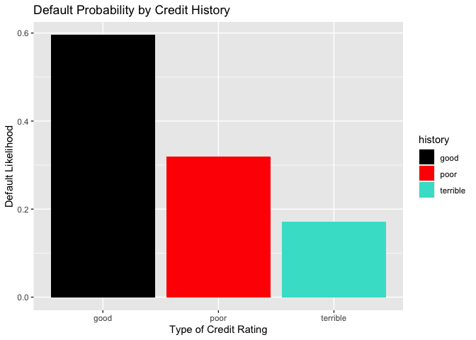
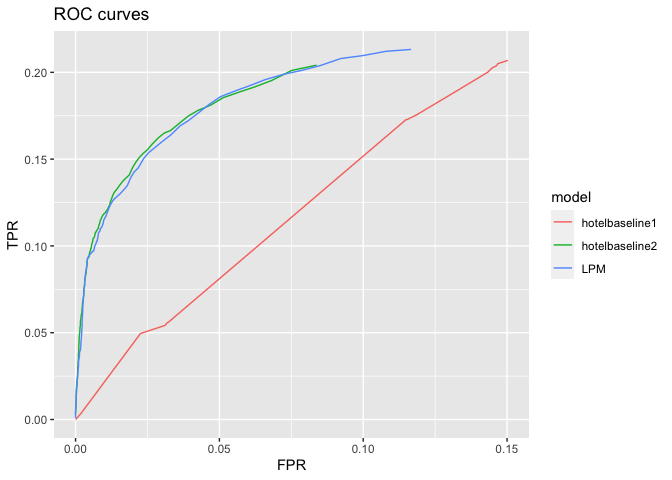
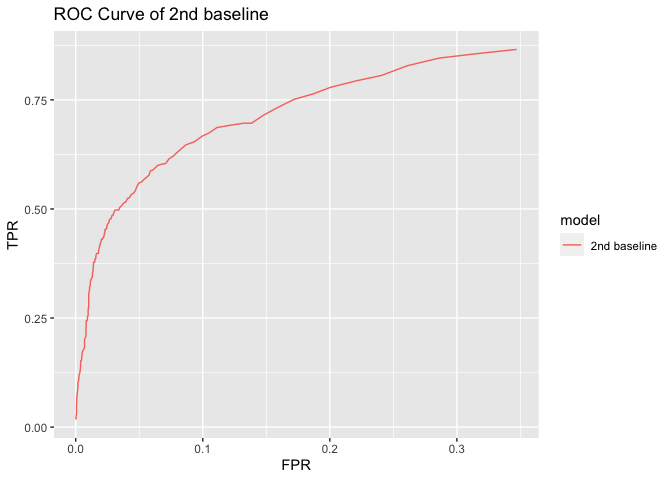

    ## ── Attaching packages ─────────────────────────────────────── tidyverse 1.3.1 ──

    ## ✓ ggplot2 3.3.5     ✓ purrr   0.3.4
    ## ✓ tibble  3.1.6     ✓ dplyr   1.0.7
    ## ✓ tidyr   1.1.4     ✓ stringr 1.4.0
    ## ✓ readr   2.1.1     ✓ forcats 0.5.1

    ## ── Conflicts ────────────────────────────────────────── tidyverse_conflicts() ──
    ## x dplyr::filter() masks stats::filter()
    ## x dplyr::lag()    masks stats::lag()

    ## Loading required package: lattice

    ## 
    ## Attaching package: 'caret'

    ## The following object is masked from 'package:purrr':
    ## 
    ##     lift

    ## Registered S3 method overwritten by 'mosaic':
    ##   method                           from   
    ##   fortify.SpatialPolygonsDataFrame ggplot2

    ## 
    ## The 'mosaic' package masks several functions from core packages in order to add 
    ## additional features.  The original behavior of these functions should not be affected by this.

    ## 
    ## Attaching package: 'mosaic'

    ## The following object is masked from 'package:Matrix':
    ## 
    ##     mean

    ## The following object is masked from 'package:modelr':
    ## 
    ##     resample

    ## The following object is masked from 'package:caret':
    ## 
    ##     dotPlot

    ## The following objects are masked from 'package:dplyr':
    ## 
    ##     count, do, tally

    ## The following object is masked from 'package:purrr':
    ## 
    ##     cross

    ## The following object is masked from 'package:ggplot2':
    ## 
    ##     stat

    ## The following objects are masked from 'package:stats':
    ## 
    ##     binom.test, cor, cor.test, cov, fivenum, IQR, median, prop.test,
    ##     quantile, sd, t.test, var

    ## The following objects are masked from 'package:base':
    ## 
    ##     max, mean, min, prod, range, sample, sum

    ## 
    ## Attaching package: 'foreach'

    ## The following objects are masked from 'package:purrr':
    ## 
    ##     accumulate, when

# Question 1: Capmetro\_UT

## Load the data for capmetro\_UT

# Recode the categorical variables in sensible, rather than alphabetical, order

## Part A: Plot Average Boardings according to the Day of the Week

    ## `summarise()` has grouped output by 'hour_of_day', 'day_of_week'. You can override using the `.groups` argument.

### Plot for Part A

#### Caption (Just in Case): Overall, the average number of boardings is
similar on weekdays and falls over the weekends for the three months
studied. This is probably because people travel to and from the
university over the weekdays (for classes) and do not have lectures over
the weekend. The peak hour of boarding is approximately 3 to 5 pm in
September, October & November as this is when a large number of classes
end. # The average number of boardings on Mondays in September is low
because of the Labor Day holiday (Monday- first week of September). #
Lower boardings for Wednesday, Thursday and Friday can most likely be
attributed to the Thanksgiving Break, when students do not have college.

## Part B: No. of Boardings depending upon Temperature in Fahrenheit

### Plot for Part B

#### Caption (just in case): The total number of boardings is higher on
weekdays and low over weekends as # college students students have
classes on weekdays. This is true for all temperatures and time (except
6-9 am, as college # students tend to sleep in). As instructed, we hold
the hour of the day and the day of the week constant. We observe that
temperature # does not have a visibly significant effect on the umber of
boardings. We can say this as the dots in the graphs are distributed
quite # evenly/consistently across different temperatures.

# Question 2: Saratoga Houses

## Load the data for SaratogaHouses

## Part A: The Linear Model

## Part B: The KNN Model

### Summary

### On comparison of the two models, we see that the Linear Model has performed better than the KNN Model. This is because the linear model has a lower RMSE than that of the KNN model, which indicates a better fit of the model. The linear model also allows us to pick the features that we want to work with (to study their impact on the price) and we can create specific interactions as well.

# Question 3: German Credit

## Part A: Bar Plot

    ## New names:
    ## * `` -> ...1

    ## Rows: 1000 Columns: 23

    ## ── Column specification ────────────────────────────────────────────────────────
    ## Delimiter: ","
    ## chr (13): checkingstatus1, history, purpose, savings, employ, status, others...
    ## dbl  (9): ...1, Default, duration, amount, installment, residence, age, card...
    ## lgl  (1): rent

    ## 
    ## ℹ Use `spec()` to retrieve the full column specification for this data.
    ## ℹ Specify the column types or set `show_col_types = FALSE` to quiet this message.

## Part B: Logistic Regression

    ## 
    ## Call:  glm(formula = Default ~ duration + amount + installment + age + 
    ##     history + purpose + foreign, family = binomial, data = german_credit)
    ## 
    ## Coefficients:
    ##         (Intercept)             duration               amount  
    ##          -7.075e-01            2.526e-02            9.596e-05  
    ##         installment                  age          historypoor  
    ##           2.216e-01           -2.018e-02           -1.108e+00  
    ##     historyterrible           purposeedu  purposegoods/repair  
    ##          -1.885e+00            7.248e-01            1.049e-01  
    ##       purposenewcar       purposeusedcar        foreigngerman  
    ##           8.545e-01           -7.959e-01           -1.265e+00  
    ## 
    ## Degrees of Freedom: 999 Total (i.e. Null);  988 Residual
    ## Null Deviance:       1222 
    ## Residual Deviance: 1070  AIC: 1094

### Summary: ## In this logistic regression model, the `historypoor` variable will decrease odds of default by 1.10, and having the `historyterrible` variable decreases odds of default by 1.885 per unit. Here, having poor or terrible credit actually decreases the probability of default, which is the opposite of the common rationale. Therefore, we think the dataset is not accurate for making a predictive model of defaults especially if the aim of the model is to find prospective borrowers to categorize them into “high” versus “low” probability of default. This is because of the way the data sampling has been done, where instead of random sampling, the bank picked the defaulted loans and looked for similar kinds of loans. This most likely created a big bias in the data collecting process. In the usual sense, it is likely that the credit history for defaulted loans is poor or terrible and it would not include enough datasets with good credit history. In fact, out of 1000 observations, less than 100 observations have a good credit history. Therefore, we would suggest the bank using a random sampling method even though it would not include a lot of defaulted loans. But, increasing the number of observations can definitely help.

# Question 4: Hotels Valuation

    ## Rows: 4999 Columns: 22

    ## ── Column specification ────────────────────────────────────────────────────────
    ## Delimiter: ","
    ## chr   (9): hotel, meal, market_segment, distribution_channel, reserved_room_...
    ## dbl  (12): lead_time, stays_in_weekend_nights, stays_in_week_nights, adults,...
    ## date  (1): arrival_date

    ## 
    ## ℹ Use `spec()` to retrieve the full column specification for this data.
    ## ℹ Specify the column types or set `show_col_types = FALSE` to quiet this message.

    ## Rows: 45000 Columns: 22

    ## ── Column specification ────────────────────────────────────────────────────────
    ## Delimiter: ","
    ## chr   (9): hotel, meal, market_segment, distribution_channel, reserved_room_...
    ## dbl  (12): lead_time, stays_in_weekend_nights, stays_in_week_nights, adults,...
    ## date  (1): arrival_date

    ## 
    ## ℹ Use `spec()` to retrieve the full column specification for this data.
    ## ℹ Specify the column types or set `show_col_types = FALSE` to quiet this message.

## The ROC curve is better for hotelbaseline 2 in the linear model than
those of hotelbaseline 1.

# Step 1 Model Validation

# Step 2 Model Validation

<table>
<thead>
<tr class="header">
<th style="text-align: left;"></th>
<th style="text-align: left;">Predicted</th>
<th style="text-align: left;">Actual</th>
<th style="text-align: left;">Difference</th>
</tr>
</thead>
<tbody>
<tr class="odd">
<td style="text-align: left;">Fold01</td>
<td style="text-align: left;">26</td>
<td style="text-align: left;">28</td>
<td style="text-align: left;">2</td>
</tr>
<tr class="even">
<td style="text-align: left;">Fold02</td>
<td style="text-align: left;">23</td>
<td style="text-align: left;">24</td>
<td style="text-align: left;">1</td>
</tr>
<tr class="odd">
<td style="text-align: left;">Fold03</td>
<td style="text-align: left;">17</td>
<td style="text-align: left;">16</td>
<td style="text-align: left;">-1</td>
</tr>
<tr class="even">
<td style="text-align: left;">Fold04</td>
<td style="text-align: left;">21</td>
<td style="text-align: left;">21</td>
<td style="text-align: left;">0</td>
</tr>
<tr class="odd">
<td style="text-align: left;">Fold05</td>
<td style="text-align: left;">21</td>
<td style="text-align: left;">20</td>
<td style="text-align: left;">-1</td>
</tr>
<tr class="even">
<td style="text-align: left;">Fold06</td>
<td style="text-align: left;">26</td>
<td style="text-align: left;">25</td>
<td style="text-align: left;">-1</td>
</tr>
<tr class="odd">
<td style="text-align: left;">Fold07</td>
<td style="text-align: left;">17</td>
<td style="text-align: left;">13</td>
<td style="text-align: left;">-4</td>
</tr>
<tr class="even">
<td style="text-align: left;">Fold08</td>
<td style="text-align: left;">18</td>
<td style="text-align: left;">19</td>
<td style="text-align: left;">1</td>
</tr>
<tr class="odd">
<td style="text-align: left;">Fold09</td>
<td style="text-align: left;">22</td>
<td style="text-align: left;">18</td>
<td style="text-align: left;">-4</td>
</tr>
<tr class="even">
<td style="text-align: left;">Fold10</td>
<td style="text-align: left;">23</td>
<td style="text-align: left;">21</td>
<td style="text-align: left;">-2</td>
</tr>
<tr class="odd">
<td style="text-align: left;">Fold11</td>
<td style="text-align: left;">23</td>
<td style="text-align: left;">20</td>
<td style="text-align: left;">-3</td>
</tr>
<tr class="even">
<td style="text-align: left;">Fold12</td>
<td style="text-align: left;">24</td>
<td style="text-align: left;">21</td>
<td style="text-align: left;">-3</td>
</tr>
<tr class="odd">
<td style="text-align: left;">Fold13</td>
<td style="text-align: left;">16</td>
<td style="text-align: left;">14</td>
<td style="text-align: left;">-2</td>
</tr>
<tr class="even">
<td style="text-align: left;">Fold14</td>
<td style="text-align: left;">18</td>
<td style="text-align: left;">14</td>
<td style="text-align: left;">-4</td>
</tr>
<tr class="odd">
<td style="text-align: left;">Fold15</td>
<td style="text-align: left;">21</td>
<td style="text-align: left;">19</td>
<td style="text-align: left;">-2</td>
</tr>
<tr class="even">
<td style="text-align: left;">Fold16</td>
<td style="text-align: left;">21</td>
<td style="text-align: left;">27</td>
<td style="text-align: left;">6</td>
</tr>
<tr class="odd">
<td style="text-align: left;">Fold17</td>
<td style="text-align: left;">17</td>
<td style="text-align: left;">19</td>
<td style="text-align: left;">2</td>
</tr>
<tr class="even">
<td style="text-align: left;">Fold18</td>
<td style="text-align: left;">24</td>
<td style="text-align: left;">21</td>
<td style="text-align: left;">-3</td>
</tr>
<tr class="odd">
<td style="text-align: left;">Fold19</td>
<td style="text-align: left;">18</td>
<td style="text-align: left;">21</td>
<td style="text-align: left;">3</td>
</tr>
<tr class="even">
<td style="text-align: left;">Fold20</td>
<td style="text-align: left;">23</td>
<td style="text-align: left;">21</td>
<td style="text-align: left;">-2</td>
</tr>
<tr class="odd">
<td style="text-align: left;">total</td>
<td style="text-align: left;">419</td>
<td style="text-align: left;">402</td>
<td style="text-align: left;">17</td>
</tr>
</tbody>
</table>

<table>
<thead>
<tr class="header">
<th style="text-align: left;"></th>
<th style="text-align: left;">Predicted</th>
<th style="text-align: left;">Actual</th>
<th style="text-align: left;">Difference</th>
</tr>
</thead>
<tbody>
<tr class="odd">
<td style="text-align: left;">Fold01</td>
<td style="text-align: left;">26</td>
<td style="text-align: left;">28</td>
<td style="text-align: left;">2</td>
</tr>
<tr class="even">
<td style="text-align: left;">Fold02</td>
<td style="text-align: left;">23</td>
<td style="text-align: left;">24</td>
<td style="text-align: left;">1</td>
</tr>
<tr class="odd">
<td style="text-align: left;">Fold03</td>
<td style="text-align: left;">17</td>
<td style="text-align: left;">16</td>
<td style="text-align: left;">-1</td>
</tr>
<tr class="even">
<td style="text-align: left;">Fold04</td>
<td style="text-align: left;">21</td>
<td style="text-align: left;">21</td>
<td style="text-align: left;">0</td>
</tr>
<tr class="odd">
<td style="text-align: left;">Fold05</td>
<td style="text-align: left;">21</td>
<td style="text-align: left;">20</td>
<td style="text-align: left;">-1</td>
</tr>
<tr class="even">
<td style="text-align: left;">Fold06</td>
<td style="text-align: left;">26</td>
<td style="text-align: left;">25</td>
<td style="text-align: left;">-1</td>
</tr>
<tr class="odd">
<td style="text-align: left;">Fold07</td>
<td style="text-align: left;">17</td>
<td style="text-align: left;">13</td>
<td style="text-align: left;">-4</td>
</tr>
<tr class="even">
<td style="text-align: left;">Fold08</td>
<td style="text-align: left;">18</td>
<td style="text-align: left;">19</td>
<td style="text-align: left;">1</td>
</tr>
<tr class="odd">
<td style="text-align: left;">Fold09</td>
<td style="text-align: left;">22</td>
<td style="text-align: left;">18</td>
<td style="text-align: left;">-4</td>
</tr>
<tr class="even">
<td style="text-align: left;">Fold10</td>
<td style="text-align: left;">23</td>
<td style="text-align: left;">21</td>
<td style="text-align: left;">-2</td>
</tr>
<tr class="odd">
<td style="text-align: left;">Fold11</td>
<td style="text-align: left;">23</td>
<td style="text-align: left;">20</td>
<td style="text-align: left;">-3</td>
</tr>
<tr class="even">
<td style="text-align: left;">Fold12</td>
<td style="text-align: left;">24</td>
<td style="text-align: left;">21</td>
<td style="text-align: left;">-3</td>
</tr>
<tr class="odd">
<td style="text-align: left;">Fold13</td>
<td style="text-align: left;">16</td>
<td style="text-align: left;">14</td>
<td style="text-align: left;">-2</td>
</tr>
<tr class="even">
<td style="text-align: left;">Fold14</td>
<td style="text-align: left;">18</td>
<td style="text-align: left;">14</td>
<td style="text-align: left;">-4</td>
</tr>
<tr class="odd">
<td style="text-align: left;">Fold15</td>
<td style="text-align: left;">21</td>
<td style="text-align: left;">19</td>
<td style="text-align: left;">-2</td>
</tr>
<tr class="even">
<td style="text-align: left;">Fold16</td>
<td style="text-align: left;">21</td>
<td style="text-align: left;">27</td>
<td style="text-align: left;">6</td>
</tr>
<tr class="odd">
<td style="text-align: left;">Fold17</td>
<td style="text-align: left;">17</td>
<td style="text-align: left;">19</td>
<td style="text-align: left;">2</td>
</tr>
<tr class="even">
<td style="text-align: left;">Fold18</td>
<td style="text-align: left;">24</td>
<td style="text-align: left;">21</td>
<td style="text-align: left;">-3</td>
</tr>
<tr class="odd">
<td style="text-align: left;">Fold19</td>
<td style="text-align: left;">18</td>
<td style="text-align: left;">21</td>
<td style="text-align: left;">3</td>
</tr>
<tr class="even">
<td style="text-align: left;">Fold20</td>
<td style="text-align: left;">23</td>
<td style="text-align: left;">21</td>
<td style="text-align: left;">-2</td>
</tr>
<tr class="odd">
<td style="text-align: left;">total</td>
<td style="text-align: left;">419</td>
<td style="text-align: left;">402</td>
<td style="text-align: left;">17</td>
</tr>
</tbody>
</table>

## The model only got 12 predictions wrong out of 4999 observations. So, if we look at every fold there is a difference but in total sums up to 12. Thus, we can say it’s a very accurate model. (This number changes every time the function is run.)
